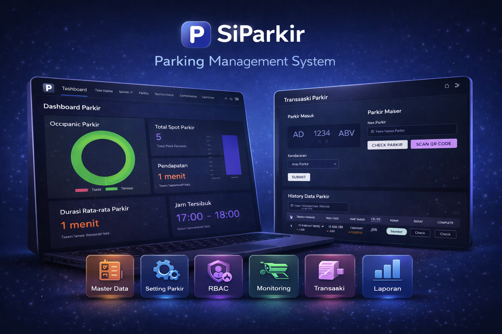

# Sistem Informasi Parkir

Sistem Informasi Parkir adalah aplikasi web berbasis Laravel yang dirancang untuk mengelola proses parkir kendaraan secara efisien. **Sistem ini menyediakan berbagai fitur untuk membantu pengelolaan parkir, mulai dari pemantauan slot, laporan parkir dan pendapatan, otorisasi menggunakan metode RBAC (Role-Based Access Control), Transaksi Parkir masuk dan keluar, dsb.**

## Fitur Utama

- **Dashboard:** Pemantuan area parkir, jam tersibuk parkir realtime, pendapatan perbulan realtime.
- **Base On Application:** Management Master Data, Role, Pemberian Accessing Users.
- **Pendaftaran Kendaraan:** Pengguna dapat mendaftarkan kendaraan mereka untuk mendapatkan akses parkir.
- **Manajemen Slot Parkir:** Admin dapat mengelola slot parkir yang tersedia dan memantau statusnya secara real-time.
- **Riwayat Parkir:** Melacak riwayat parkir kendaraan, termasuk waktu masuk dan keluar.
- **Laporan:** Menyediakan laporan terkait penggunaan parkir dan pendapatan.
- **Otorisasi:** Otorisasi menggunakan metode RBAC (Role-Based Access Control).
- **Sistem QRCode:** Di Sistem ini sudah integrasi dengan QRCode dimana QRCode akan discan guna untuk menghandle parkir yang akan keluar

## Prasyarat

Pastikan kamu telah menginstal dan atau mengkonfigurasi dibawah ini:
- Install Laragon version terbaru
- Docker (Optional)
- PHP 8.3 atau lebih baru
- Composer version terbaru
- Node.js version terbaru
- PostgreSQL
- Di php.ini aktifkan dulu **extension=zip**

## Instalasi Versi Local

Ikuti langkah-langkah berikut untuk menginstal dan menjalankan proyek:

1. **Clone Repository**

    ```bash
    git clone https://github.com/bimanyunugroho/abisa-parkir.git
    cd abisa-parkir
    ```

2. **Instalasi Dependensi**

    - **Instal Composer Dependencies**

      ```bash
      composer install
      ```

    - **Instal Node Dependencies**

      ```bash
      npm install
      ```

3. **Salin File .env**

    Salin file `.env.example` menjadi `.env`:

    ```bash
    cp .env.local .env
    ```
    
    ```bash
    Buka VSCode nya -> code .
    Lalu ubah .env di :
    - Line 1 APP_NAME ganti dari Laravel menjadi SI-Parkir atau sesuka kamu sendiri
    - Line 5 APP_TIMEZONE ganti dari UTC menjadi Asia/Jakarta
    - Line 6 APP_URL ganti menjadi APP_URL=http://abisa-parkir.test
    ```

4. **Generate Kunci Aplikasi**

    Jalankan perintah untuk membuat kunci aplikasi:

    ```bash
    php artisan key:generate
    ```

5. **Konfigurasi Database**

    Edit file `.env` dan atur pengaturan database kamu:

    ```env
    DB_CONNECTION=pgsql
    DB_HOST=127.0.0.1
    DB_PORT=5432
    DB_DATABASE=buat_database_kamu_sendiri
    DB_USERNAME=postgres
    DB_PASSWORD=

    Note:
    - By default DB_USERNAME adalah postgres 
    - Jadi tidak perlu diubah 
    - kecuali kamu punya konfigurasi lain.
    ```

6. **Migrasi Database**

    Jalankan perintah berikut untuk membuat tabel-tabel yang diperlukan:

    ```bash
    php artisan migrate:refresh --seed
    ```

7. **Running Application**

    Jalankan perintah berikut untuk membuat tabel-tabel yang diperlukan:

    ```bash
    npm run dev
    ```
    
    ```bash
    - Masuk ke browser kamu dan ketikan, 
    abisa-parkir.test (ini kalau kamu pakai Laragon)
    ```
   
--------------------------------------------------------------------


## Instalasi Versi Docker
**Note:**
- Untuk proyek ini saya ada di lingkungan **Ubuntu**, jadi bisa saja kalau kalian pakai **Windows** kemungkinan akan sedikit berbeda. Jadi bisa disesuaikan saja ya.
- Pastikan **PORT 5433**  pada **Postgres** tidak digunakan, karena nantinya akan bentrok
- Kalau sudah digunakan **PORT 5433** bisa diubah dulu **docker-compose.yml** portnya misalkan 5439:5432 **(HOST PORT MESIN KAMU: HOST PORT CONTAINER BY DEFAULT 5432)**

### 1. Clone Repository

```bash
git clone https://github.com/bimanyunugroho/abisa-parkir.git
cd abisa-parkir
```

### 2. Setup Environment

```bash
cp .env.docker .env
```

### 3. Setup Docker

```bash
docker -v (Pastikan sudah terinstall dulu)

docker compose up -d --build
docker compose up -d
docker ps


- Pastikan sudah jalan semua container nya
- Untuk container siparkir_queue ini akan error karena belum di migrate database
- Nantinya akan normal kembali setelah di migrate
```

---

### 4. Setup App Laravel in Docker Tahap 1

```bash
docker exec -it siparkir_app bash
composer install
php artisan key:generate
php artisan migrate:refresh
php artisan db:seed
php artisan storage:link
npm ci && npm run build
chmod -R 755 storage bootstrap/cache
exit
```

---

### 4.1 Setup App Laravel in Docker Tahap 2

```bash
docker compose down -v
docker compose up -d
docker ps

- Semua container berjalan dengan normal setelah melakukan di point 4
```

---

### 5. Jalankan Aplikasi

Akses di browser:

```
http://localhost
```

---

1. **User Admin Default**

    Jalankan perintah berikut untuk membuat tabel-tabel yang diperlukan:

    ```bash
    EMAIL= abisa@gmail.com
    PASSWORD= abisa12345
    ```

9. **Note**

    - Untuk versi Developement ini kamu ngga bisa gunain fitur QrCode karena membutuhkan akses SSL atau protocol HTTPS
    - Tapi tenang saja kamu bisa akses fitur itu dengan menggunakan **NGROK**
    - Kalau masih tetap ngga bisa caranya, kamu boleh ko' hubungi **ADMIN**

### Lisensi

© 2024 - 2024 @abisa.officiall - All Rights Reserved.
