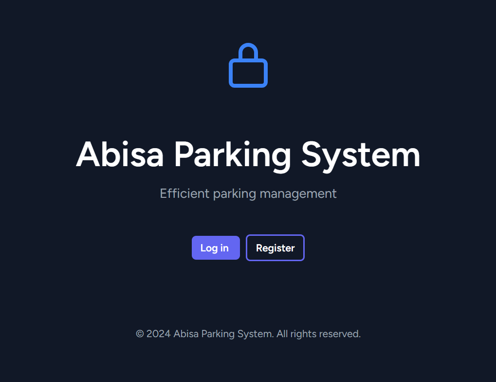

<p align="center">
  <a href="https://www.linkedin.com/in/bimanyunugroho/" target="_blank">
    
  </a>
  &nbsp;&nbsp;&nbsp;
  
  &nbsp;&nbsp;&nbsp;
  
  &nbsp;&nbsp;&nbsp;
  
</p>

## Sistem Informasi Parkir

Sistem Informasi Parkir adalah aplikasi web berbasis Laravel yang dirancang untuk mengelola proses parkir kendaraan secara efisien. **Sistem ini menyediakan berbagai fitur untuk membantu pengelolaan parkir, mulai dari pemantauan slot, laporan parkir dan pendapatan, otorisasi menggunakan metode RBAC (Role-Based Access Control), Transaksi Parkir masuk dan keluar, dsb.**

### Fitur Utama

- **Dashboard:** Pemantuan area parkir, jam tersibuk parkir realtime, pendapatan perbulan realtime.
- **Base On Application:** Management Master Data, Role, Pemberian Accessing Users.
- **Pendaftaran Kendaraan:** Pengguna dapat mendaftarkan kendaraan mereka untuk mendapatkan akses parkir.
- **Manajemen Slot Parkir:** Admin dapat mengelola slot parkir yang tersedia dan memantau statusnya secara real-time.
- **Riwayat Parkir:** Melacak riwayat parkir kendaraan, termasuk waktu masuk dan keluar.
- **Laporan:** Menyediakan laporan terkait penggunaan parkir dan pendapatan.
- **Otorisasi:** Otorisasi menggunakan metode RBAC (Role-Based Access Control).

### Prasyarat

Pastikan kamu telah menginstal dan atau mengkonfigurasi dibawah ini:
- Install Laragon version terbaru
- PHP 8.3 atau lebih baru
- Composer version terbaru
- Node.js version terbaru
- PostgreSQL
- Di php.ini aktifkan dulu **extension=zip**

### Instalasi

Ikuti langkah-langkah berikut untuk menginstal dan menjalankan proyek:

1. **Clone Repository**

    ```bash
    git clone https://github.com/bimanyunugroho/abisa-parkir.git
    cd abisa-parkir
    ```

2. **Instalasi Dependensi**

    - **Instal Composer Dependencies**

      ```bash
      composer install
      ```

    - **Instal Node Dependencies**

      ```bash
      npm install
      ```

3. **Salin File .env**

    Salin file `.env.example` menjadi `.env`:

    ```bash
    cp .env.example .env
    ```

4. **Generate Kunci Aplikasi**

    Jalankan perintah untuk membuat kunci aplikasi:

    ```bash
    php artisan key:generate
    ```

5. **Konfigurasi Database**

    Edit file `.env` dan atur pengaturan database kamu:

    ```env
    DB_CONNECTION=pgsql
    DB_HOST=127.0.0.1
    DB_PORT=5432
    DB_DATABASE=buat_database_kamu_sendiri
    DB_USERNAME=postgres
    DB_PASSWORD=

    Note:
    - By default DB_USERNAME adalah postgres 
    - Jadi tidak perlu diubah 
    - kecuali kamu punya konfigurasi lain.
    ```

6. **Migrasi Database**

    Jalankan perintah berikut untuk membuat tabel-tabel yang diperlukan:

    ```bash
    php artisan migrate:refresh --seed
    ```

6. **Running Application**

    Jalankan perintah berikut untuk membuat tabel-tabel yang diperlukan:

    ```bash
    npm run dev
    ```
    
    ```bash
    - Masuk ke browser kamu dan ketikan, 
    abisa-parkir.test (ini kalau kamu pakai Laragon)
    ```

6. **User Admin Default**

    Jalankan perintah berikut untuk membuat tabel-tabel yang diperlukan:

    ```bash
    EMAIL= abisa@gmail.com
    PASSWORD= abisa12345
    ```

### Lisensi

© 2024 - 2024 @abisa.officiall - All Rights Reserved.